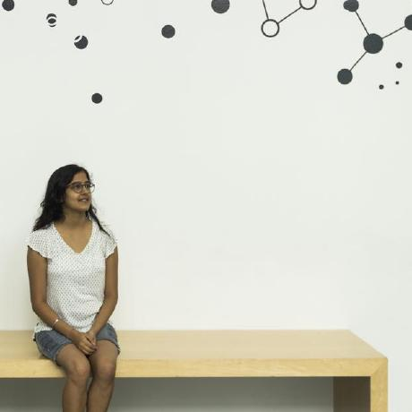
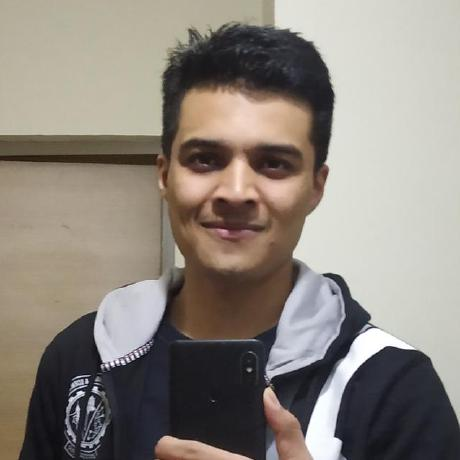

# AyurGenomics-Viz-ML
Ayurgenomics Visualisation and Machine Learning

## Proposed title

'To develop machine learning algorithm for visualizing heterogenous multidimentional 
phenomics and genomics data'

## Objectives
- To develop ML algorithm to visualize individual-level signature based on multiple phenotypes
	- Develop algorithm to capture phenotype to phenotype relationship
	- Develop algorithm to capture within Prakriti signatures
	- Develop algorithm to capture between Prakriti signatures
	- Design visual representation of individual-level signature based on above algorithms 
	
- To develop ML algorithm to associate phenotype with gene expression 
	- Use existing methodologies to find above associations
	- Develop novel ML algorithms to find multi-phenotype association with molecular cues.

## BITS scholars invovled in the project

  
  
  
  
  
  

## Mentors

## TA
- [Rintu Kutum](https://github.com/rintukutum)

## Background
Technological advancement in high-throughput experiments (HTE) allow us to decipher 
many biological insights such as, how transcription factor interact with downstream 
genes, with the aid of machine learning algorithms. Machine learning algorithm play a very
vital and integral part of understand complex biological event where we profile
multitude of genes and uncover patterns from it. Most HTE involve experients, where
the phenotype of interest (<strong>Xpheno</strong>) is simple such as (case/control, normal/disease conditions)
and accordingly we developed algorithms to infer genes(<strong>Yg</strong>) as predictors of the phenotypes (eg., cancer).
In recent years, we started appreciating the fact that other covariate such as
age, sex, environmental conditions along with our phenotype of interest could
play a vital role in regulation within cellular. Overview of phenomics and genomics data is illustrated below in Figure-01.

## What we did?
You may follow the link below for a detaiiled overview of the project.
[Report]()
## References
- 2017, PLoS One, [Recapitulation of Ayurveda constitution types by machine learning of phenotypic traits](https://doi.org/10.1371/journal.pone.0185380)
- 2011, ACS Chemical Biology, [Ayurgenomics: A New Way of Threading Molecular Variability for Stratified Medicine](https://doi.org/10.1021/cb2003016)
- 2016, Journal of Genetics, [Genomic insights into ayurvedic and western approaches to personalized medicine](https://www.ias.ac.in/article/fulltext/jgen/095/01/0209-0228)
- [EGLN1 involvement in high-altitude adaptation revealed through genetic analysis of extreme constitution types defined in Ayurveda]
- 2018, PNAS, [Digitizing omics profiles by divergence from a baseline](https://www.pnas.org/content/115/18/4545.long)
- [A primer on deep learning in genomics](https://www.nature.com/articles/s41588-018-0295-5.pdf)
- Nature Review Genetics, [Machine learning applications in genetics and genomics](https://www.nature.com/articles/nrg3920)
- Hunter K. John, UC Davis [Measure Theory Notes](https://www.math.ucdavis.edu/~hunter/measure_theory/measure_notes.pdf)
- Devroye L, Wise GL (1980) [Detection of abnormal behavior via nonparametric estimation of the support, SIAM J Appl Math 38:480–488](https://pdfs.semanticscholar.org/9c34/6f8a40d31d884c8d5496d1d46a4a0b1848d7.pdf)
- Luscombe NM, Laskowski RA, Thornton JM. [Amino acid-base interactions: a three-dimensional analysis of protein-DNA interactions at an atomic level](https://www.ncbi.nlm.nih.gov/pmc/articles/PMC55782/)
- Kevin Struhl, [Fundamentally Different Logic of Gene Regulation in Eukaryotes and Prokaryotes](https://www.sciencedirect.com/science/article/pii/S0092867400805991?via%3Dihub#FIG1)
- Zhang Y, IEEE, 2019, [A Unified Entropy-Based Distance Metric for Ordinal-and-Nominal-Attribute Data Clustering](https://ieeexplore.ieee.org/document/8671525)
- [Questionnare](https://static-content.springer.com/esm/art%3A10.1186%2F1479-5876-6-48/MediaObjects/12967_2008_278_MOESM2_ESM.pdf)
