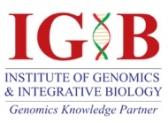
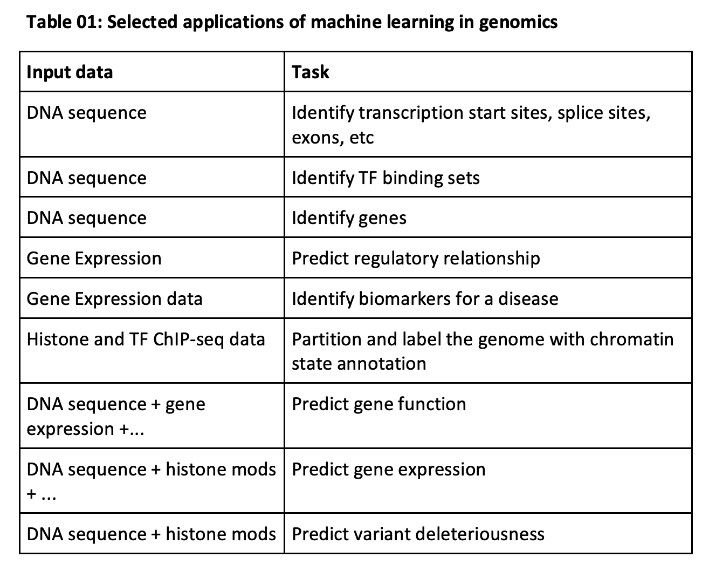
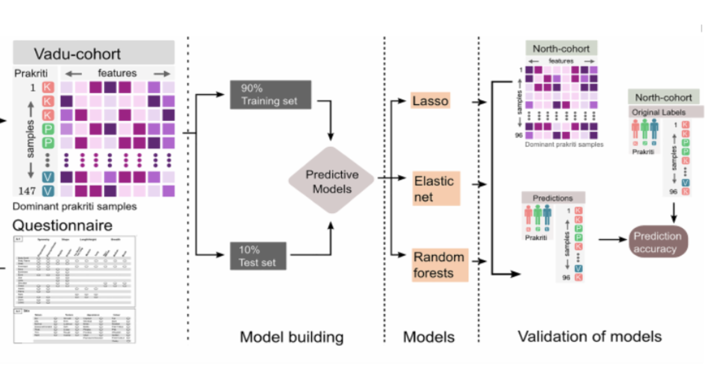
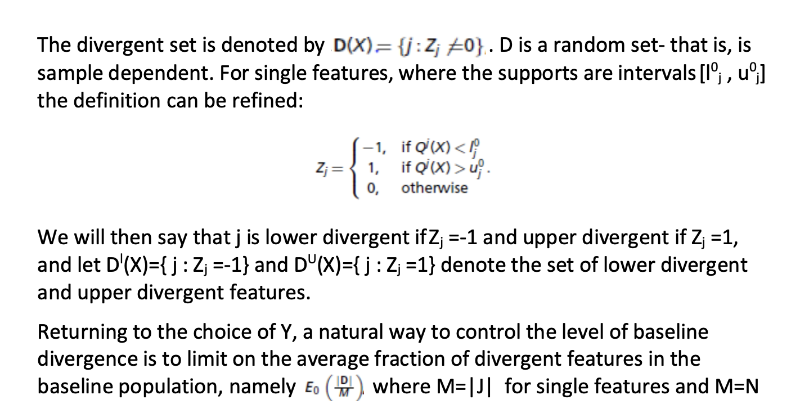

A REPORT ON **DATA VISUALIZATION & ML IN AYURGENOMICS** UNDERTAKEN AT **CSIR -- INSTITUTE OF GENOMICS & INTEGRATIVE BIOLOGY**

A PRACTISE SCHOOL-I STATION OF **BIRLA INSTITUTE OF TECHNOLOGY AND SCIENCE, PILANI** **JULY, 2019**

  
  

**GROUP MEMBERS**

ISHITA MEDIRATTA (2017A7PS1013G)

ANMOL AGARWAL (2017B3A70489G)

KARTIK BHATIA (2017A7PS0051G)

SYED AHSAN ABBAS (2017B3A70507P)

ROHIT JAIN (2017A7PS0122P)

NISHCHIT SONI (2017B3A71035P)

  
  

### BIRLA INSTITUTE OF TECHNOLOGY AND SCIENCE PILANI (RAJASTHAN)
### Practice School Division

**Station(s):** New Delhi **Centre:** CSIR-IGIB, Mathura Road

**Duration From:** 21 May 2019 **To:** 14 July 2019

**Date of submission:** 14 July 2019

**Title of the Project:** To develop machine learning algorithm for visualizing heterogeneous multidimensional phenomics and genomics data

**Discipline:** Computer Science

**Name(s) of the expert:** Dr Mitali Mukerji, Dr Bhavana Prasher

**Designation:** Senior Principal Scientist

**Name of the PS Faculty:** Dr Deepak Chitkara

**Key Words:** Data Visualization, Machine Learning, Ayurgenomics, Genomics, Prakriti, Phenotypes, Divergence, Quantiles

**Project Area(s):** Data Visualization, Machine Learning, Ayurgenomics

  
  

# <u>
OBJECTIVES
</u>

1. To develop ML algorithm to visualize individual-level signature based on multiple phenotypes
  * Develop an algorithm to capture phenotype to phenotype relationship
  * Develop an algorithm to capture within Prakriti signatures
  * Develop an algorithm to capture between Prakriti signatures
  * Design visual representation of individual-level signature based on the above algorithms
2. To develop ML algorithm to associate phenotype with gene expression
  * Use existing methodologies to find above associations
  * Develop novel ML algorithms to find the multi-phenotype association with molecular cues

  
  

# <u>
ABSTRACT
</u>

In the Ayurveda system of medicine, individuals are classified into seven constitution types, "Prakriti", for assessing disease susceptibility and drug responsiveness, which are assigned to an individual based on a set of phenotypes. Phenotypes can be categorised into 4 main types, 1) Anatomy 2) Physical 3) Physiological and 4) Psychological. In total, more than 100 phenotypes are required to assess Prakriti types of an individual by an Ayurvedic physician. Existing visual representation exist such as somatotype, which represents persons’ physical and psychological traits based on quantitative measures. But Prakriti phenotyping is through only qualitative measurements. Various machine learning algorithms exist such as PCA, MDS plot, tSNE, etc, for the visual representation of large scale datasets. Here, we aim to develop machine learning algorithms for visualizing this heterogeneous multi-dimensional phenomics and genomics data. Firstly, we used qualitative phenotypes to develop and design algorithms for visual representation at individual-level. Secondly, we intend to use existing algorithms and design algorithms to find an association between quantitative phenotype with molecular phenotypes such as gene expression profiles.

  
  

# <u>
ACKNOWLEDGEMENT
</u>

We wish to express our gratitude towards Mr Rintu Kutum, Teaching Assistant of 
our project group, for his enthusiastic support, cooperation and help. We wish 
to thank him for facilitating this programme which gave us an opportunity to 
have academic exposure. We sincerely thank the staff of IGIB, especially Dr Mitali, 
Sr. Principal Scientist (Genomics and Molecular Medicine -- Ayurgenomics) 
and Dr Bhavana, Principal Scientist (Ayurgenomics: Translational Research on Ayurveda) for 
their time, support, guidance and encouragement.

We express our gratitude towards Dr Deepak Chitkara, our 
PS-I faculty for his guidance and support throughout the training here. 
We also wish to thank the Practice School Division of BIRLA INSTITUTE 
OF TECHNOLOGY AND SCIENCE, PILANI for giving us the opportunity 
to train and learn at CSIR-IGIB.

  
  

# <u>
TABLE OF CONTENTS
</u>

i. Abstract ii. Acknowledgement 

<!-- -->
<ol>
 <li> Knowing The Organization </li>
 <ul>
  <li> Mission </li>
  <li> Research Areas </li>
 </ul>
 <li> Introduction </li>
 <li> About Genomics </li>
 <li> Machine Learning in Genomics </li>
 <li> Ayurveda and Genomics: AyurGenomics</li>
 <li> Machine Learning in Ayurgenomics </li>
 <li> Research Paper Discussion </li>
 <ul>
  <li> Divergence Model For Classification </li>
 </ul>
<li> References </li> 
</ol>

  
  

# <u>
KNOWING THE ORGANIZATION
</u>

CSIR-Institute of Genomics & Integrative Biology (IGIB) is a premier 
Institute of Council of Scientific and Industrial Research (CSIR), engaged in 
research of national importance in the areas of genomics, molecular medicine, 
bioinformatics and proteomics.

> **<i>MISSION</i>**-  *"To translate concepts developed in 
basic biological research to commercially viable technologies for health care"*   

IGIB was established in 1977 as the Centre for Biochemical Technology (CBT). 
The Functional Genomics Unit was established in 1998 with the focus 
shifting from chemical to genomics research. The institute was renamed 
\"Institute of Genomics and Integrative Biology\" in 2002.

## RESEARCH AREAS

### I. Genomics and Molecular Medicine 

Genomics and Molecular Medicine is the major research 
focus of IGIB. From large collaborative projects like the 
Indian Genome Variation Consortium project to exploring the 
genetics of complex disorders using a candidate gene approach 
several groups at IGIB are involved in studying the molecular 
basis of human diseases.

They focus on:

* Neuropsychiatric disorders like Schizophrenia 
* Diabetes and other complex disorders.

### II.Cardio-Respiratory Disease Biology 

A significant number of IGIB scientists focus on respiratory 
diseases using clinical, genetic, molecular and drug development 
approaches to tackle this challenging area.

The diseases of interest here are:

* M. Tuberculosis 
* Asthma and Allergy 
* Chronic Obstructive Pulmonary Disorder (COPD)

### III. Chemical and Systems Biology 

Chemical approaches are essential in the understanding of many 
biological phenomena. Several research groups at IGIB have come 
together to utilize their varied expertise in different disciplines 
of chemistry and biology to address contemporary research problems 
that require interdisciplinary cross-talk. Research carried out at 
IGIB in this area involves:

* Chemical biology and systems biology of M. tuberculosis and skin pigmentation 
* chemically modified oligonucleotides for biological applications 
* Nano biotechnology 
* Novel immunoassay procedures 
* New molecules

### IV. Informatics and Big Data

IGIB has over the years built up expertise in high-throughput 
data analysis and genome annotation. It is participating in 
international efforts like the Gen2Phen Consortium for unifying 
genetic variation databases. Genome Informatics also forms 
an integral part of most other research areas at IGIB and 
contributes to the development of tools and hypotheses. The 
areas where informatics has contributed to genome analysis include:

* Indian Genome Variation: analysis of genome variation data 
* Next-gen sequencing, assembly and annotation 
* Unfolded proteins and adhesins 
* Prediction of microRNA-target interaction 
* Structural regulatory motifs in the genome

### V. Integrative and Functional Genomics 

Functional & Integrative Genomics is devoted to large-scale studies 
of genomes and their functions, including systems analyses of 
biological processes.

  
  

# <u>
INTRODUCTION
</u>

It is well recognized that genetic variations in genes and gene to gene interactions
can lead to system-wide level changes, which might confer differential response
among individuals to a disease condition. Currently, various -omics studies suggest
better management or diagnosis of diseases such as, cancer immunotherapy,
through stratification of patients based on endophenotypes (mRNA, miRNA, protein
profiles). Ayurveda is a traditional Indian system of medicine which provides a
methodology to stratify healthy individuals into categories on the basis of phenotypic
attributes. The individuals in each category can have specific susceptibility towards
different diseases, and drug responsiveness as mentioned in Ayurveda. The
underlying philosophy of Ayurveda emphasizes on the use of natural means to
eliminate the root cause of the disease and maintain homeostasis with the
environment. The system proposes the concept of ‘Tridoshas’ namely Vata, Pitta, and
Kapha. Different proportions of these ‘Tridoshas’ yields into seven Prakriti types,
namely Vata(V), Pitta(P), Kapha(K), VP, PK, VK and VPK; thus prescribing a distinctive
treatment plan based on their unique constitution. Prakriti evaluation involves
clinical examination including questions about anatomical, physiological, physical and
psychological traits. This approach while providing an ideal framework for the
stratification of the diseased and the healthy population also takes into account the
individual variations thus improving the drug efficacy. The traits, when identified with
the corresponding Prakriti type, can be used as the basis for the prescription of the
medicine thus working towards the idea of Predictive, Preventive, Personalized and
Participatory (P4) medicine.

  
  

# <u>
ABOUT GENOMICS
</u>

Genomics or functional genomics aims to characterize the function of every genomic
element of an organism by using genome-scale high throughput assays such as
genome sequencing, transcriptome profiling, epigenomics, metabolomics, and
proteomics (2). Genomics can give insights about plausible associations between
genotype and phenotype (3), discovering biomarkers for patient stratification,
predicting functions of genes etc.(4)
After the publication by James D. Watson and Francis Crick confirmed the structure
of DNA in 1953 (6), nucleic acid sequencing became a major point of interest for early
molecular biologists, leading to the discovery of “codons” in the DNA by Marshall
Nirenberg and Har Gobind Khorana led research team in 1961 and the first nucleic
acid sequence in 1964 by Robert Holley and his colleagues (7).
In 1977, Frederick Sanger developed a sequencing technique for DNA to sequence
the first complete genome, called phiX174 virus, which opened the doorway to the
possibility in the field of genomics.
The Human Genome Project was launched in 1990 with the aim to sequence all 3
billion letters of the human genome. Chromosome 22 was the first chromosome to
be sequenced as a part of this project in 1999. The project was completed in 2003
and confirmed that humans have 20,000-25,000 genes (8). In 2007, there was a
breakthrough in the technology used to sequence DNA, which led to a 70-fold
increase in the output of DNA sequencing in one year. This led to the launch of the
1000 Genes Project in 2008, which aimed to sequence the genomes of a large
population group of 2500.

### Indian Genome Variation Project

The Indian Genome variation project was initiated in 2003 by six laboratories of
Council of Scientific and Industrial Research (CSIR) based on a network program
which focussed primarily on repeats and single nucleotide polymorphism[25]. The
objective was to collect 15000 individual from different subpopulation considering
the ethnic diversity in the country and identify 1000 genes related to common
diseases and drug responses and identify a minimum of five to ten informative
markers per the Indian subpopulation gene. Being the first large scale comprehensive
study of the structure of Indian population, the project aims to meet the ultimate
goal of creating a DNA variation database of the Indian population to study the
human biology with respect to disease predisposition and adverse drug reaction.

  
  

# MACHINE LEARNING IN GENOMICS

There has been an exponential increase in the number of multi-dimensional, highly-complex datasets available, that have been generated through years of research in
the last 20 years. The immense amount of genomics data generated by genomic
researchers provide a huge opportunity for the development of statistical machine
learning algorithms to uncover patterns from it. These statistical machine learning
methods can be used in identifying different types of genomic elements, recognizing
patterns in DNA sequences, and developing models that can take other genetic and
genomic information as input to build systems to help understand the biological
mechanisms of underlying genes etc (9)
Machine learning is an emerging field in computer science wherein algorithms are
developed and programmed to infer patterns and gain novel insights from the data,
using a plethora of mathematical concepts. The learned model can then be used to
predict any range of outputs, such as binary responses, categorical labels, or
continuous values (13). A few applications of statistical machine learning in the field
of genomics is mentioned in Table 01.

  
  

# AYURVEDA and GENOMICS: AYURGENOMICS

Ayurgenomics is an emerging field that integrates high-throughput genomics
experiments to investigate Ayurvedic stratification methodology (Prakriti)(18).
Prasher B. et.al., (24) showed molecular signatures and biochemical among extreme
Prakriti types (K, P & V) based on 96 healthy individuals. One of the genes identified
in this study was EGLN1(27), which was further studied in detail to understand the
association of genotypes(SNP) with high-altitude adaptation (disease condition, High
Altitude Pulmonary Edema). 

  
  

# MACHINE LEARNING IN AYURGENOMICS

Tiwari P, Kutum R, Sethi TP et.al.,(20) developed machine learning models to classify
extreme Prakriti types based on 154 questionnaire data Figure 01. They have used
unsupervised clustering approaches to uncover structure within the questionnaire
data of 147 individuals. Based on supervised learning minimum feature sets were
identified to the classification of extreme Prakriti types. More than 85% mean
accuracy was observed in LASSO, elastic net and Random forests models, which were
validated in another cohort (North cohort). Additionally, models were built to
identify extreme Prakriti types from non-extreme Prakriti types. 

  
  

# DIVERGENCE MODEL FOR CLASSIFICATION

### QUANTILES AND QUANTILE NORMALIZATION

Quantile is a line that divides a sample distribution into 
equal subgroups. By definition, the median of a sample is 
a 50% or a 0.5 quantile.

Each individual omic profile can be transformed into quantile 
space by replacing each element of the profile is replaced by 
its normalized rank with respect to the other elements in the 
same profile.

Define

This is called as Quantile Normalization.

This definition of quantiles is sample-based (i.e., they are 
computed across variables measured for a single subject), not 
population or cohort-based. In genomics, it is very difficult 
to find the desired samples and hence, a sample based model 
provides a better accuracy with lesser outliers.

### DIVERGENCE

Let U be a random variable assuming values in space *U* and let Po be a 
reference or baseline distribution on *U* with support *supp*(*P*o) 
belonging to *U*. Then a value of u belongs to *U* is divergent if 
*u does not belong to* *supp*(*P*o). Divergence, by definition, is a 
sample property.

An omics profile is a vector. Where the index set 
J and the values assumed by individual features, Xj depends on the 
particular data modality determined by the measurement technology.

Suppose we are given a reference joint probability distribution Po 
associated with some baseline phenotype. Given an omics profile X and 
a subset S belonging to J, we will apply the definition of divergence 
to the random vector

 Let m=|S|, so that US takes values in \[0, 1\]m. We describe below how the support *US*~o~ belonging to \[0, 1\]m can be estimated from the data, resulting in a set .

When presented with a new sample X, we define a binary variable by

We will then say that the set S is divergent (for the considered sample) if

and only if Z=1.

### SUPPORT ESTIMATION

The support of the random vector  under Po is estimated by a "covering" of the observed baseline samples. Let d be a metric on \[0, 1\]m (we will use the Euclidean distance). Assume that no independent and identically distributed (i.i.d.) samples of X are observed under Po, resulting in i.i.d. Samples *US*(1), : : : , *US*(*n*o); these are now no points in \[0,1\]m . We will define an increasing sequence of empirical supports indexed by a "smoothing" parameter ~ᵞ~. Let *l*=*l*(~ᵞ~)=\[*n*o], the greatest integer less than or equal to gamma times *n*0 . For each let rk denote the distance between *US*(*k*)and its *I*th nearest neighbour. We define

(eq.2)

Where *B*(*US*(*k*), *rk*) denotes the closed ball of centre *US*(*k*) and radius rk In other terms, a point u belongs to \[0,1\]m if and only if there exists  such that *US*(*k*) is closer to *u* than to its *I*th nearest neighbour. The smoothing parameter corresponds to the "bandwidth" in multivariate density estimation, and our estimator is based on nearest neighbour distances.

The estimate of the support in Eq. 2 is very conservative: Every subprofile S is nondivergent for every sample from the baseline population. This is unrealistic, not only in view of possible outliers among the baseline samples but also because these baseline samples may, in fact, contain a small proportion of nonbaseline cell types. Another drawback is that is yet to be specified. We address these two issues simultaneously. Again, let *r*1, ....., *rno* be the radii of the balls centred at baseline samples. Now let r' be the 95th percentile (or quantile) of these radii. Instead of covering all of the baseline samples, we remove the 5% for which before computing the support. That is, the support is constructed as in Eq. 2 but with the union over all *k*=1, ....., *n*0. replaced by the union over {*k* : *rk* ≤ r'}.

An example of the estimated support for two genes (\|*S*\|=2) and Y=0.1 is shown in the figure below.

#### Figure
2D baseline support. Fifty normal samples (blue points) and 50 luminal A samples (red stars) were chosen at random from The Cancer Genome Atlas (TCGA) breast cancer data. The area of support computed using the normal samples is shown by the gray shade; the samples falling outside the hsupport are declared divergent.

### INTUITION FOR THE DIVERGENCE MODEL

Both Divergence and the Quantile Normalization are sample properties. Since, we have small n (number of samples) and large p (number of parameters) divergence model can be used for the classification of individuals to different Prakritis trained with less number of samples yet providing optimal accuracies.

  
  

# <u>
REFERENCES</u>

1. Systems Biology and P4 Medicine: Past, Present, and Future PMID: 23908862
2. Hieter, P. & Boguski, M. Functional genomics: it’s all how you read it. Science
278, 601–602 (1997). PMID: 9381168
3. Ozaki, K. et al. Functional SNPs in the lymphotoxin-α gene that are associated
with susceptibility to myocardial infarction. Nat. Genet. 32, 650–654 (2002).
PMID: 12426569
4. Golub, T. R. et al. Molecular classification of cancer: class discovery and class
prediction by gene expression monitoring. Science 286, 531–537 (1999)
5. Oliver, S. Guilt-by-association goes global. Nature 403, 601–603 (2000) PMID:
10688178
6. Watson JD, Crick FH. 1953. Molecular structure of nucleic acids: a structure for
deoxyribose nucleic acid. Nature 171: 737–38
7. Maxam AM, Gilbert W. 1977. A new method for sequencing DNA. PNAS 74:
560–64 PMID: 265521
8. Lander ES, Linton LM, Birren B, Nusbaum C, Zody MC, et al. 2001. Initial
sequencing and analysis of the human genome. Nature 409: 860–921 PMID:
11237011
9. Libbrecht MW, Noble WS. Machine learning applications in genetics and
genomics. Nat Rev Genet. 2015;16(6):321–332. doi:10.1038/nrg3920 PMID:
25948244
10. Camacho et al., Next-Generation Machine Learning for Biological Networks,
Cell (2018), PMID: 29887378
11. E. S. Lander et al., ‘‘Initial sequencing and analysis of the human genome,’’
PMID: 15829235
12. Deep learning for genomics, https://doi.org/10.1038/s41588-018-0328-0
13. Karr et al., "A whole-cell computational model predicts phenotype from
genotype. Cell 150, 389-401. PMID: 22817898
14. Chen, B., and Butte, A.J. (2016). Leveraging big data to transform target
selection and drug discovery. Clin. Pharmacol. Ther. 99, 285–297. PMID:
26659699
15. di Bernado et al. Chemogenomic profiling on a genome-wide scale using
reverse-engineered gene networks. Nat. Biotechnol. 23, 377–383.
16. L. Cong et al., ‘‘Multiplex genome engineering using CRISPR/Cas systems,’’
Science, vol. 339, no. 6121, pp. 819–823, 2013. PMID: 23287718
17. September 2016, IAS, blogadmin, Ayurgenomics – a new player in biomedical
sciences
18. Prasher B., Gibson G. and Mukerji M. 2016 Genomic insights into ayurvedic and
western approaches to personalized medicine. PMID: 27019453
19. Parasuraman S, Thing GS, Dhanaraj SA. Polyherbal formulation: Concept of
Ayurveda. Pharmacogn Rev. PMID: 25125878
20. 2017, PLoS One, Recapitulation of Ayurveda constitution types by machine
learning of phenotypic traits PMID: 28981546
21. 2011, ACS Chemical Biology, Ayurgenomics: A New Way of Threading
Molecular Variability for Stratified Medicine
22. 2016, Journal of Genetics, Genomic insights into ayurvedic and western
approaches to personalized medicine
23. 2018, PNAS, Digitizing omics profiles by divergence from a baseline
24. 2008, Journal of Translational Medicine, Whole genome expression and
biochemical correlates of extreme constitutional types defined in Ayurveda
25. 2005, Springer link, the Indian genome variation database: a project
overview.[pmid :16133172 ]
26. 2017, Journal of Ethnopharmacology, Ayurgenomics for stratified medicine:
TRISUTRA consortium initiative across ethnically and geographically diverse
Indian populations[ pmid:28981546]
27. 2010, PNAS, EGLN1 involvement in high altitude adaptation revealed through
genetic analysis of extreme constitution datatypes defined in
Ayurveda.[pmid: 20956315]
