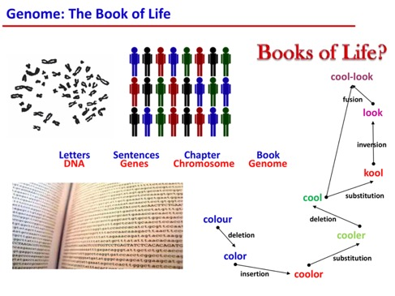
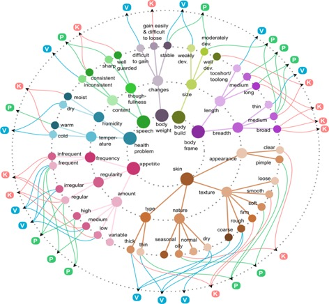
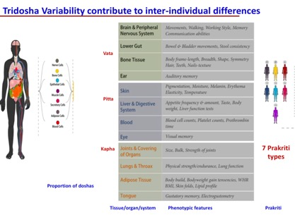
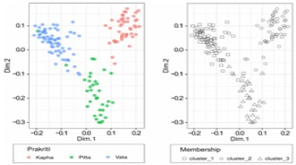
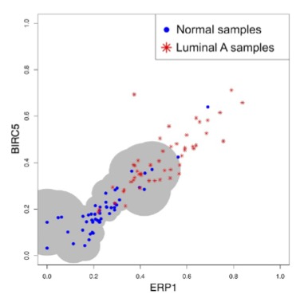

A REPORT ON **DATA VISUALIZATION & ML IN AYURGENOMICS** UNDERTAKEN AT **CSIR -- INSTITUTE OF GENOMICS & INTEGRATIVE BIOLOGY**

A PRACTISE SCHOOL-I STATION OF **BIRLA INSTITUTE OF TECHNOLOGY AND SCIENCE, PILANI** **JULY, 2019**

  
  

**GROUP MEMBERS**

ISHITA MEDIRATTA (2017A7PS1013G)

ANMOL AGARWAL (2017B3A70489G)

KARTIK BHATIA (2017A7PS0051G)

SYED AHSAN ABBAS (2017B3A70507P)

ROHIT JAIN (2017A7PS0122P)

NISHCHIT SONI (2017B3A71035P)

  
  

### BIRLA INSTITUTE OF TECHNOLOGY AND SCIENCE PILANI (RAJASTHAN)
### Practice School Division

**Station(s):** New Delhi **Centre:** CSIR-IGIB, Mathura Road

**Duration From:** 21 May 2019 **To:** 14 July 2019

**Date of submission:** 14 July 2019

**Title of the Project:** To develop machine learning algorithm for visualizing heterogeneous multidimensional phenomics and genomics data

**Discipline:** Computer Science

**Name(s) of the expert:** Dr Mitali Mukerji, Dr Bhavana Prasher

**Designation:** Senior Principal Scientist

**Name of the PS Faculty:** Dr Deepak Chitkara

**Key Words:** Data Visualization, Machine Learning, Ayurgenomics, Genomics, Prakriti, Phenotypes, Divergence, Quantiles

**Project Area(s):** Data Visualization, Machine Learning, Ayurgenomics

  
  

# <u>
ABSTRACT
</u>

Technological advancement in high-throughput experiments (HTE) allows us to decipher many biological insights, such as, how transcription factor interact with the downstream genes. This is done with the aid of machine learning algorithms. Machine learning algorithms play a very vital and integral part in understanding the complex biological event of profiling the multitude of genes and uncovering patterns from it. Most HTE involve experiments have the phenotypes of interest (X~pheno~) simple, such as (case/control, normal/disease conditions) and accordingly there are algorithms to infer genes (Y~g~) as predictors of these phenotypes (e.g. cancer). In recent years, we have started appreciating the fact that other covariate such as age, sex, environmental conditions along with our phenotype of interest could play a vital role in regulation within the cellular level.

In the Ayurveda system of medicine, individuals are classified into seven constitution types, "Prakriti", for assessing disease susceptibility and drug responsiveness, which are assigned to an individual based on these phenotypes. We aim to develop machine learning algorithms for visualizing this heterogeneous multi-dimensional phenomics and genomics data.

  
  

# <u>
ACKNOWLEDGEMENT
</u>

We wish to express our gratitude towards Mr Rintu Kutum, Teaching Assistant of our project group, for his enthusiastic support, cooperation and help. We wish to thank him for facilitating this programme which gave us an opportunity to have academic exposure. We sincerely thank the staff of IGIB, especially Dr Mitali, Sr. Principal Scientist (Genomics and Molecular Medicine -- Ayurgenomics) and Dr Bhavana, Principal Scientist (Ayurgenomics: Translational Research on Ayurveda) for their time, support, guidance and encouragement.

We express our gratitude towards Dr Deepak Chitkara, our PS-I faculty for his guidance and support throughout the training here. We also wish to thank the Practice School Division of BIRLA INSTITUTE OF TECHNOLOGY AND SCIENCE, PILANI for giving us the opportunity to train and learn at CSIR-IGIB.

  
  

# <u>
TABLE OF CONTENTS
</u>

i. Abstract ii. Acknowledgement 

<!-- -->
<ol>
 <li> Knowing The Organization </li>
 <ul>
  <li> Mission </li>
  <li> Achievements </li>
  <li> Research Areas </li>
 </ul>
 <li> Introduction </li>
 <li> Ayurveda </li>
 <li> Ayurgenomics </li>
 <li> Research Paper Discussion </li>
 <ul>
  <li> Plos One: Recapitulation Of Ayurveda Constitution Types By Machine Learning Of Phenotypic Traits </li>
  <li> Divergence Model For Classification </li>
 </ul>
<li> Citations </li> 
</ol>

  
  

# <u>
KNOWING THE ORGANIZATION
</u>

CSIR-Institute of Genomics & Integrative Biology (IGIB) is a premier Institute of Council of Scientific and Industrial Research (CSIR), engaged in research of national importance in the areas of genomics, molecular medicine, bioinformatics and proteomics.

> **<i>MISSION</i>**-  *"To translate concepts developed in basic biological research to commercially viable technologies for health care"*   

IGIB was established in 1977 as the Centre for Biochemical Technology (CBT). The Functional Genomics Unit was established in 1998 with the focus shifting from chemical to genomics research. The institute was renamed \"Institute of Genomics and Integrative Biology\" in 2002.

## ACHIEVEMENTS

In 2009, a team at the Institute sequenced the genome of the wild-type Zebrafish, with about 1.7 billion base pairs. This made the fish, which is native to the Himalayan region, the first vertebrate to have its whole genome sequenced in India, as previously Indian scientists had only sequenced bacteria and plant genomes.

In December 2009, scientists at IGIB performed the first re-sequencing of a human genome in India. The Institute also collaborated on decoding the first Sri Lankan genome and Malaysian genome.

## RESEARCH AREAS

### I. Genomics and Molecular Medicine 

Genomics and Molecular Medicine is the major research focus of IGIB. From large collaborative projects like the Indian Genome Variation Consortium project to exploring the genetics of complex disorders using a candidate gene approach several groups at IGIB are involved in studying the molecular basis of human diseases.

They focus on:

* Neuropsychiatric disorders like Schizophrenia 
* Diabetes and other complex disorders.

### II.Cardio-Respiratory Disease Biology 

A significant number of IGIB scientists focus on respiratory diseases using clinical, genetic, molecular and drug development approaches to tackle this challenging area.

The diseases of interest here are:

* M. Tuberculosis 
* Asthma and Allergy 
* Chronic Obstructive Pulmonary Disorder (COPD)

### III. Chemical and Systems Biology 

Chemical approaches are essential in the understanding of many biological phenomena. Several research groups at IGIB have come together to utilize their varied expertise in different disciplines of chemistry and biology to address contemporary research problems that require interdisciplinary cross-talk. Research carried out at IGIB in this area involves:

* Chemical biology and systems biology of M. tuberculosis and skin pigmentation 
* chemically modified oligonucleotides for biological applications 
* Nano biotechnology 
* Novel immunoassay procedures 
* New molecules

### IV. Informatics and Big Data

IGIB has over the years built up expertise in high-throughput data analysis and genome annotation. It is participating in international efforts like the Gen2Phen Consortium for unifying genetic variation databases. Genome Informatics also forms an integral part of most other research areas at IGIB and contributes to the development of tools and hypotheses. The areas where informatics has contributed to genome analysis include:

* Indian Genome Variation: analysis of genome variation data 
* Next-gen sequencing, assembly and annotation 
* Unfolded proteins and adhesins 
* Prediction of microRNA-target interaction 
* Structural regulatory motifs in the genome

### V. Integrative and Functional Genomics 

Functional & Integrative Genomics is devoted to large-scale studies of genomes and their functions, including systems analyses of biological processes.

  
  

# <u>
INTRODUCTION
</u>

In today's time, there has been an ever-increasing need on the endo-phenotyping and omics studies for stratifying groups on the basis of differences in susceptibility, prognosis and therapeutics towards diseases, which is the underlying basis for the P4 medicine. While there have been a lot of methods developed in modern times, India already has a 5000-years old study of Ayurveda. In the Ayurveda system of medicine, individuals are classified into 7 constitution types, "Prakriti", for assessing disease susceptibility and drug responsiveness. Prakriti evaluation involves clinical examination including questions about physiological and behavioural traits. V, P and K are referred to as extreme (distinct) Prakriti while other four Prakriti types VP, PK, VK and VPK are referred here as non-extreme Prakriti.

#### Whole genome expression and molecular correlates between Ayurveda and Modern Medicine

It is well acknowledged that subtle variations in large number of genes and their interactions can give rise to system-wide changes which confer differential predisposition to diseases. These variations are common and contribute to 95% of the inter-individual differences observed both at the expression and genetic level in a population. The differences between subsets of individuals from a homogeneous population which are at the phenotypic endpoints of normal health spectrum were identified using method of classification described in Ayurveda. The extreme constitution types reveal differences at the gene expression level as well as biochemical levels and also included genes with reported disease involvement. Interestingly, they also reveal differences in a significant number of hub and housekeeping genes which if perturbed can have system-wide effects.

To optimally extract useful knowledge contained within Ayurveda, it is important to develop a modern framework in which such assumptions are tested, followed by the development of methods that would enable standardised implementations that are rapid, accurate and scalable. Therefore, there is a need to develop a computational framework for predicting Prakriti classes from phenotypic attributes, which may be useful in precision medicine for stratification of endophenotypes in healthy and diseased populations.

**In the following sections, we'll be explaining the underlying concepts that will be used along the course of our project, covering a brief summary of various literatures already read by the group.**

  
  

# <u>
AYURVEDA
</u>

### INTRODUCTION

**Ayurveda** is a system of medicine with historical roots in the [Indian subcontinent](https://en.wikipedia.org/wiki/Indian_subcontinent). Globalized and modernized practices derived from Ayurveda traditions are a type of [alternative medicine](https://en.wikipedia.org/wiki/Alternative_medicine). In countries beyond India, Ayurvedic therapies and practices have been integrated in general [wellness](https://en.wikipedia.org/wiki/Wellness_(alternative_medicine)) applications and in some cases in medical use.

The main classical Ayurveda texts begin with accounts of the transmission of medical knowledge from the Gods to sages, and then to human physicians. Ayurveda therapies have varied and evolved over more than two millennia. Therapies are typically based on complex herbal compounds, minerals and metal substances (perhaps under the influence of early Indian alchemy or [*rasa shastra*](https://en.wikipedia.org/wiki/Rasa_shastra)). Ancient Ayurveda texts also taught surgical techniques, including rhinoplasty, [kidney stone extractions](https://en.wikipedia.org/wiki/Lithotomy), sutures, and the extraction of foreign objects.

The central theoretical ideas of Ayurveda developed in the mid-first millennium BCE, and show parallels with Sāṅkhya and Vaiśeṣika philosophies, as well as with Buddhism and Jainism. Balance is emphasized, and suppressing natural urges is considered unhealthy and claimed to lead to illness. For example, to suppress sneezing is said to potentially give rise to shoulder pain. However, people are also cautioned to stay within the limits of reasonable balance and measure when following nature\'s urges. For example, the emphasis is placed on moderation of food intake, sleep, and sexual intercourse.

Ayurveda names seven basic tissues ([dhatu](https://en.wikipedia.org/wiki/Dhatu_(Ayurveda))), which are plasma (*rasa*), blood (*rakta*), muscles (*māmsa*), fat (*meda*), bone (*asthi*), [marrow](https://en.wikipedia.org/wiki/Bone_marrow) (*majja*), and semen (*shukra*). Like the medicine of classical antiquity, Ayurveda has historically divided bodily substances into five [classical elements](https://en.wikipedia.org/wiki/Classical_element#Classical_elements_in_Hinduism), (Sanskrit) [*panchamahabhuta*](https://en.wikipedia.org/wiki/Panchamahabhuta), viz. [earth](https://en.wikipedia.org/wiki/Prithvi), [water](https://en.wikipedia.org/wiki/Ap_(water)), [fire](https://en.wikipedia.org/wiki/Agni), [air](https://en.wikipedia.org/wiki/Vayu) and [ether](https://en.wikipedia.org/wiki/Ether_(classical_element)).

  
  

# AYURGENOMICS

### INTRODUCTION

In Ayurveda texts, though the principles of phenotypes in health and disease states are extremely well described, they are not readily decipherable and hence its potential has not been appreciated by modern genomic researchers. According to Ayurveda individual's basic constitution (Prakriti) describes its predisposition and prognosis to disease status and also the treatment for disease and lifestyle regime. In Genomics, an individual's basic constitution is decided by its genetic makeup which indirectly reflects the levels of various biochemical parameters in an individual which states its Health status. The authors aimed at the establishment of a high correlation of Prakriti with genomic signatures by isolating DNA, RNA and Plasma from the blood sample.

It is anticipated that this approach of Ayurgenomics would allow the development of surrogate methods for cost-effective screening of predisposed individuals in the population. This would result in the development of an integrative approach to systems biology for disease and health state.

Ayurveda follows a systems approach that has interesting parallels with contemporary personalized genomic medicine approaches to the understanding and management of health and disease. It is based on the trisutra, meaning the three interconnected aspects of causes (hetu), features (linga) and therapeutics (aushadha) both for healthy and diseased people. The question thus arises as to whether there are molecular and genomic correlates of trisutra that are interconnected through a common organizing principle termed 'tridosha'.

Tridosha comprises three ascertainable physiological entities; Vata (kinetic), pitta (metabolic) and Kapha (potential) that are pervasive across systems, work in conjunction with each other, respond to the external environment and maintain homeostasis. Each individual is born with a specific proportion of tridosha that are not only genetically determined but also influenced by the environment during foetal development. Jointly they determine a person's basic constitution, which is termed their 'prakriti'. Development and progression of different diseases with their subtypes are thought to depend on the origin and mechanism of perturbation of the doshas, and the aim of the therapeutic practice is to ensure that the doshas retain their homeostatic state. Similarly, western systems biology epitomized by translational P4 medicine envisages the integration of multiscalar genetic, cellular, physiological and environmental networks to predict phenotypic outcomes of perturbations.

The concepts and practice of Ayurveda resonate with the aims, observations and the promise of contemporary P4 medicine; it is predictive, preventive, personalized and participatory medicine. Currently, the science of network medicine is primarily observational, involving big data and large amounts of correlations.

In Ayurveda system of medicine individuals are classified into seven constitution types, "*Prakriti*", for assessing disease susceptibility and drug responsiveness. *Prakriti* evaluation involves clinical examination including questions about physiological and behavioural traits. In the present era of phenomics, there has been an increase in emphasis on endo-phenotyping along with omics approaches for identification of groups that differ in susceptibility, prognosis and therapeutic requirements. There is an unmet need for the development of adequate phenotyping methods for stratification of healthy individuals at a systemic level. Phenotypic stratification of healthy individuals forms the primary basis for predictive and personalised medicine in Ayurveda.

A study has revealed molecular differences between the extreme *Prakriti* types. Assuming that the *Prakriti* types correspond to objectively identifiable sub-phenotypes, they should form clusters within a multidimensional space where the axes conform to the phenotypic traits used for clinical stratification To optimally extract useful knowledge contained within Ayurveda, it is important to develop a modern framework *Prakriti* assessment involves examination of more than 150 features with anatomical and physical activity related attributes that can be directly examined and physiological and psychological parameters inferred based on the responses of the individual and past history.

### Ayurgenomics: A New Way of Threading Molecular Variability for Stratified Medicine

To explore the molecular basis of three most different Prakriti types, predominantly V, P, and K a questionnaire was designed that could capture the clinical features described in Ayurvedic literature for phenotyping of Prakriti in an objective manner. To minimise the effect of confounding factors on the expression of Prakriti, we conducted our study on age- and sex-matched subjects from a genetically homogeneous Indo-European (IE) background. The homogeneity of the V, P, and K subjects and relatedness with the background population was confirmed through phylogenetic analysis using a set of unlinked markers studied in the Indian Genome Variation Consortium project. individuals who have a predominance of V, P, or K in their Prakriti exhibit differences in

• Gross biochemical levels in peripheral blood

• Expression at the genome-wide levels

• Genetic level, i.e., variations in DNA that are more stable than gene expression

Significant differences in biochemical profiles between the Prakriti types were further validated through bootstrap resampling. For instance, P males had higher values for

Most of the haematological parameters such as haemoglobin.

Transcriptional profiles of pooled RNA from V, P, and K revealed differences in core biological processes between these Prakriti groups. This led us to hypothesise that there is indeed an underlying cellular system in each Prakriti type that can be assessed through the modern genomics approach, for example, the Ayurvedic abstraction of Kapha as being the promoter of anabolic state overlapped with the overall up regulation of genes involved in cellular biosynthesis including ATP and cofactor biosynthesis and purine salvage pathway.

Different facets of the immune function seemed to be differentially modulated in different Prakriti types. Thus susceptibility to infections, atopy, and allergic reactions are likely to vary according to the constitution types. This is important as host adaptive and innate immune responses shape the human systems biology through the diet-microbiota axis. Also noteworthy among the differentially expressed genes was a significant over-representation of hub and housekeeping genes. Differential expression of hub genes could, therefore, modulate a series of networks and pathways and could have system-wide effects. P had overexpression of hub genes involved in pro-apoptotic functions and positive regulation of innate immune response.

Genetic analysis was carried out on a subset of differentially expressed genes to test whether common variations in these genes exhibit differences between the constitution types; 14 SNPs were observed from 5 genes to differ significantly between the Prakriti types. The genes that distinguish

These groups are involved in development (FAS, AKT3, FBN2), multiple signalling pathways (FAS, AKT3), interact with various proteins (RAD51, FAS, INSR), or are prominent drug targets (EGLN1, FAS, AKT3).

Most importantly, once the genotypes of all the constitution types were pooled, the combined allele frequency was similar to the Indo-European background population that they were derived from. This indicates that inherent genetic differences within a heterogeneous mix of healthy individuals get masked in the absence of a method that allows us to stratify them.

  
  

# PLOS ONE: Recapitulation of Ayurveda constitution types by machine learning of phenotypic traits

### INTRODUCTION

A need was felt to develop models for accurately predicting Prakriti classes that have been shown to exhibit molecular differences. The present study was carried out on data of phenotypic attributes in 147 healthy individuals of three extreme Prakriti types, from a genetically homogeneous population of Western India. Unsupervised and supervised machine learning approaches were used to infer the inherent structure of the data, and for feature selection and building classification models for Prakriti respectively. This study was the first to demonstrate that Prakriti types are distinct verifiable clusters within a multidimensional space of multiple interrelated phenotypic traits. It also provides a computational framework for predicting Prakriti classes from phenotypic attributes. This approach may be useful in precision medicine for stratification of endophenotypes in healthy and diseased populations.

### METHODS

1. Recruitment of subjects and clinical assessment of Prakriti - Detailed Prakriti evaluation was carried out in 528 individuals by Ayurveda physicians using a questionnaire and subjects assigned into one of the seven subtypes.

2. Pre-processing of data - Out of the original questionnaire, 133 questions were finally included for the final study.

3. Genetic homogeneity of the population - The genetic relatedness and homogeneity of the VADU cohort with Indian population was established by analysis of the VADU genotype data with shared SNPS in the Indian Genome Variation Consortium panel.

4. Unsupervised clustering of individuals - A random forest model consisting of 1 million decision trees was constructed in unsupervised mode to derive similarity matrix. Silhouette width was used as a criterion to identify optimum cluster numbers. A similar analysis was carried out on all samples to test whether non-extreme samples were indeed a mixture of the constituent Prakriti types.

5. Supervised modelling of the questionnaire - Three methods were used for extreme Prakriti modelling of the questionnaire.

 a. LASSO model - The regression framework of the LASSO model was used for extreme Prakriti modelling as it addresses the problems of multicollinearity arising out of a large number of explanatory variables. It includes a penalty function in the model that shrinks the regression coefficients of insignificant or unnecessary explanatory variables to zero.

 b. Elastic net model - When the data have highly correlated predictors LASSO tends to select only one variable and removes the correlated variable/s. Since there might be some interaction involved in the variables, grouped selection might be needed for future reference which is done in the elastic net.

 c. Random forests model - Random forests (RF) is an ensemble decision tree based algorithm, where each decision tree is built independently from different bagging samples and randomly selecting a subset of features. Two parameters namely ntree (number of decision trees) and mtry (a subset of features to be chosen randomly) were optimized before building the final training model.

6. Validation of models on an external dataset from a different population - The models were validated in a dataset of an earlier study from the North Indian population.

### RESULTS

1. Genotyping analysis confirmed the genetic homogeneity of the study Population - Vadu cohort belongs to an Indo-European background from Western India. The genetic homogeneity of the cohort was confirmed using a panel of markers from Indian Genome.

2. Identification of extreme Prakriti - A total of 147 extreme Prakriti individuals were identified which consisted of three types namely Kapha (n = 46), Pitta (n = 35) and Vata (n = 66). Apart from extreme Prakriti type, 106 samples were also classified as non-extreme type VP, PK and VK.

3. The emergence of three distinct robust clusters through unsupervised learning of questionnaire data from extreme Prakriti.

4. Three distinct supervised learning approaches provide a core set of variables that accurately predict Prakriti - Through feature selection methods, identified a minimal set of features from the 133 attributes that could most accurately identify the extreme groups from a heterogeneous population.

5. Replication of Prakriti models across two cohorts of diverse genetic backgrounds - Tested all the three models built on Vadu cohort in a North Indian data from our earlier study. The class-wise accuracy (sensitivity) for Kapha, Pitta and Vata was 93.1%, 82.7% and 94.7% respectively from the LASSO model and 96.5%, 86.2% and 97.3% respectively from elastic net and 100%, 79.3% for Pitta and 97.37% for Vata.

6. Development of a classifier for identification of extreme Prakriti groups from heterogeneous populations - It was tested whether extreme or non-extreme Prakriti with equal accuracy. Using the above model, probability distributions of Prakriti-membership scores upon non-extreme data did not show a preferential skew towards any of the labels.

  

# DIVERGENCE MODEL FOR CLASSIFICATION

### QUANTILES AND QUANTILE NORMALIZATION

Quantile is a line that divides a sample distribution into equal subgroups. By definition, the median of a sample is a 50% or a 0.5 quantile.

Each individual omic profile can be transformed into quantile space by replacing each element of the profile is replaced by its normalized rank with respect to the other elements in the same profile.

Define

This is called as Quantile Normalization.

This definition of quantiles is sample-based (i.e., they are computed across variables measured for a single subject), not population or cohort-based. In genomics, it is very difficult to find the desired samples and hence, a sample based model provides a better accuracy with lesser outliers.

### DIVERGENCE

Let U be a random variable assuming values in space *U* and let Po be a reference or baseline distribution on *U* with support *supp*(*P*o) belonging to *U*. Then a value of u belongs to *U* is divergent if *u does not belong to* *supp*(*P*o). Divergence, by definition, is a sample property.

An omics profile is a vector. Where the index set J and the values assumed by individual features, Xj depends on the particular data modality determined by the measurement technology.

Suppose we are given a reference joint probability distribution Po associated with some baseline phenotype. Given an omics profile X and a subset S belonging to J, we will apply the definition of divergence to the random vector

 Let m=|S|, so that US takes values in \[0, 1\]m. We describe below how the support *US*~o~ belonging to \[0, 1\]m can be estimated from the data, resulting in a set .

When presented with a new sample X, we define a binary variable by

We will then say that the set S is divergent (for the considered sample) if

and only if Z=1.

### SUPPORT ESTIMATION

The support of the random vector  under Po is estimated by a "covering" of the observed baseline samples. Let d be a metric on \[0, 1\]m (we will use the Euclidean distance). Assume that no independent and identically distributed (i.i.d.) samples of X are observed under Po, resulting in i.i.d. Samples *US*(1), : : : , *US*(*n*o); these are now no points in \[0,1\]m . We will define an increasing sequence of empirical supports indexed by a "smoothing" parameter ~ᵞ~. Let *l*=*l*(~ᵞ~)=\[*n*o], the greatest integer less than or equal to gamma times *n*0 . For each let rk denote the distance between *US*(*k*)and its *I*th nearest neighbour. We define

(eq.2)

Where *B*(*US*(*k*), *rk*) denotes the closed ball of centre *US*(*k*) and radius rk In other terms, a point u belongs to \[0,1\]m if and only if there exists  such that *US*(*k*) is closer to *u* than to its *I*th nearest neighbour. The smoothing parameter corresponds to the "bandwidth" in multivariate density estimation, and our estimator is based on nearest neighbour distances.

The estimate of the support in Eq. 2 is very conservative: Every subprofile S is nondivergent for every sample from the baseline population. This is unrealistic, not only in view of possible outliers among the baseline samples but also because these baseline samples may, in fact, contain a small proportion of nonbaseline cell types. Another drawback is that is yet to be specified. We address these two issues simultaneously. Again, let *r*1, ....., *rno* be the radii of the balls centred at baseline samples. Now let r' be the 95th percentile (or quantile) of these radii. Instead of covering all of the baseline samples, we remove the 5% for which before computing the support. That is, the support is constructed as in Eq. 2 but with the union over all *k*=1, ....., *n*0. replaced by the union over {*k* : *rk* ≤ r'}.

An example of the estimated support for two genes (\|*S*\|=2) and Y=0.1 is shown in the figure below.

#### Figure
2D baseline support. Fifty normal samples (blue points) and 50 luminal A samples (red stars) were chosen at random from The Cancer Genome Atlas (TCGA) breast cancer data. The area of support computed using the normal samples is shown by the gray shade; the samples falling outside the hsupport are declared divergent.
### INTUITION FOR THE DIVERGENCE MODEL

Both Divergence and the Quantile Normalization are sample properties. Since, we have small n (number of samples) and large p (number of parameters) divergence model can be used for the classification of individuals to different Prakritis trained with less number of samples yet providing optimal accuracies.

  
  

# <u>
CITATIONS</u>

- 2017, PLoS One, [[Recapitulation of Ayurveda constitution types by machine learning of phenotypic traits]](https://doi.org/10.1371/journal.pone.0185380)

- 2011, ACS Chemical Biology, [[Ayurgenomics: A New Way of Threading Molecular Variability for Stratified Medicine]](https://doi.org/10.1021/cb2003016)

- 2016, Journal of Genetics, [[Genomic insights into ayurvedic and western approaches to personalized medicine]](https://www.ias.ac.in/article/fulltext/jgen/095/01/0209-0228)

- 2018, PNAS, [[Digitizing omics profiles by divergence from a baseline]](https://www.pnas.org/content/115/18/4545.long)

- 2008, Journal of Translational Medicine, [[Whole genome expression and biochemical correlates of extreme constitutional types defined in Ayurveda]](https://doi.org/10.1186/1479-5876-6-48) 
